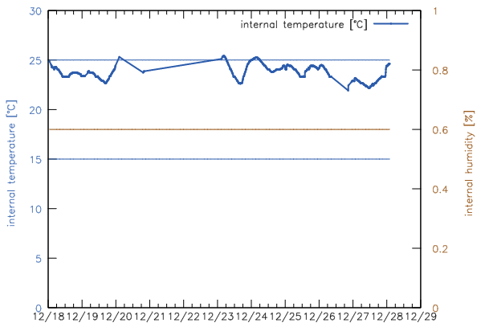

# MediTemp
> A program for monitoring the temperature in your medication cabinet and warning you via Telegram when it's too hot or cold - complete with setup instructions

If you've ever lived in a one-room-appartment, you know how difficult it can be to keep your medication at a medication-friendly temperature and humidity.
There's steam from the kitchen, humidity from the shower, coldness from opening the windows at night and heat from closing them in winter.

MediTemp is a solution -admittedly for linux powerusers mainly- that allows you to monitor the temperature in your medication cabinet using a Linux machine and a small temper usb thermometer connected with an usb cable.
It plots the temperature and humidity, one data point every 10 minutes, and stores it in a csv file, and it sends you a notification (e.g. on your phone) via Telegram whenever temperature or humidity fall into bad ranges.
There are even instructions on how to get a ringtone from your phone whenever ths occurs (on android)!

## How does this work?

It's just a small python script that you will have to start (with sudo) everytime your machine starts.
This README contains detailed information on how to set up the thermometer and the USB connection to it, how to get these components, how to set up the connection via Telegram, and potentially the ringtone notification if you want to get one everytime the temperature goes out of bounds.

## When will I get warning notifications?

Whenever the temperature is lower than 15°C or higher than 25°C, or when the humidity is higher than 60%.
You can change these values by editing the `meditemp.py` file.
You can also change the interval in which the temperature is changed in the file (defaults to 10 minutes, checking the temperature more often can cause the temperature device to heat up its surroundings or itself).

## How do I set up the hardware?

You'll need a TEMPer device, which looks like a USB stick, but contains a thermometer and, in some cases, a humidity sensor that can be accessed by a connected machine.
The one I used (for which this program is tested) is the [classic TEMPer device](https://www.amazon.de/-/en/gp/product/B07BFBSF57/ref=ppx_yo_dt_b_asin_title_o05_s00?ie=UTF8&psc=1) which is also pretty affordable (around 15USD), but doesn't offer humidity support; alternatives and how to identify them are listed [here](devices.md).

You will also need a USB A DOM to USB A SUB cable to connect the TEMPer device to your machine on which you run meditemp;
the one I used is [this one](https://www.amazon.de/-/en/gp/product/B00BBPVNFE/ref=ppx_yo_dt_b_asin_title_o02_s00?ie=UTF8&th=1).
You could, theoretically, do without this if you store your machine in your medicine cabinet, but I wouldn't recommend this since your machine will emit heat into the medicine cabinet and also heat up the temperature sensor itself.

It should be mentioned that all of the TEMPer devices measure their internal temperature, so the temperature reported may be higher than the one of their surroundings.

### optional hardware components

If you want to minimize temperature changes for the emds, you could put them and the thermometer into a thermos bag.
This might cause them to get warmer due to the heat generated by the thermometer, though, which might be a problem if your room is already on the warmer side (but might be a positive side effect if it isn't).
You should also make sure to only open the bag under good temperature conditions if you do this, since otherwise you'll end up keeping your meds at suboptimal temperatures longer than needed with this bag.

## How do I set up the software?

### Like this (bash):

```bash
# Clone the repo
git clone git@github.com:phseiff/MediTemp.git
cd MediTemp
# or like this:
# git clone https://github.com/phseiff/MediTemp.git

# make sure gnuplot is installed
# if you don't want your temperature plotted you can skip this
sudo apt-get install -y gnuplot

# install telegram-send and set it up
# if you don't want warning notifications you can skip this
sudo pip3 install telegram-send
telegram-send --configure
# you will now have to go to https://telegram.me/BotFather to
#  create a bot, and paste the bot token; just follow the 
#  instructions telegram-send gives you on this.
```

### You should then run the following command, to test if everything works right:
```bash
sudo python3 meditemp.py \
    --no-gnuplot `# <- only if skipped the gnuplot step above` \
    --no-notif `# <- only if you skipped the telegram-send step` \
    #--no-log `# <- disables error log - not recommended!!!` \
```

### What should happen now are the following things:

1. You should get a temperature log printed in the console, one line every 10 minutes, like this: `12/28/2021, 01:43; 24.56`
2. A file called `med_temp.csv` will be created, in which the temperature is logged, each line being in a `"time[%m/%d/%Y, %H:%M]; temp[°C]; humidity[%]` format.
3. A file called `meditemp-log.txt` will be created, in which, if `--no-log` isn't set, errors and the time they occurred will be logged.
   None of these errors will ever crash the program.
4. If `--no-gnuplot` isn't set, a file called `med_temp.html` should be created, which you can open in your browser to see how the temperature changed over time.
   You can change `meditemp.gnuplot` to midufy how the plot looks like.
   <details><summary>Click here to see an image of the plot.</summary>

   As you can see, the temperature is plotted in blue with blue boundaries around the "healthy" area, and the humidity is plotted in brown, with an upper bound for the "healthy" area in brown.<br/>
   
   </details>
5. If `--no-notifs` isn't set and the temperature or humidity falls out of bounds, you should receive a telegram notification from the bot you created that goes like `Temperature alert: 25.18°` or like `Humidity alert: 61%`.

All of the files created by meditemp are persistent throughout all runs (restarting doesn't overwrite their content, instead adding to it), and updated everytime temperature and humidity are measured, not just when the program is exited.
The program runs with sudo (otherwise connecting to the thermometer won't work for some reason), but all files are saved and created with the local user as their owner.

### Setting up an alarm for notifications

If you are on android and want to get a ringtone whenever you get a notification, you can either set custom notifications for the bot (this should work in iOS too) by going into your chat with the bot, clicking the bot's name, clicking on "Notifications" and choosing "Customize", then customizing, or you can use [an app called Message Alarm](https://play.google.com/store/apps/details?id=com.app.messagealarm) which allows you to set specific notifications (as in, ringtones) for specific telegram contacts (such as your bot).
You have to add Telegram to the applications tracked by the app to achieve this, and then add the username (not the handle!) of your bot to the tracked users.

### Starting meditemp with every system restart

run

```bash
sudo nano /bin/rc.local
```

(you might have to enter your root password) and then add

```bash
sudo python3 [absolute path to meditemp]/meditemp.py [optional arguments] &
```

before the `exit 0` and after the shebang and anything else in the file (the ampersand is important).

Then press <kbd>Ctrl</kbd>+<kbd>X</kbd> and press <kbd>y</kbd> and <kbd>Enter</kbd>.

## What to do in case of bugs?

If you encounter a bug please report it with the entire relevant parts of `meditemp-log.txt`, as well as the command you used.
If you encounter an error with `--no-logfile` and do not have the error message from your console, please try to replicate the error without `--no-logfile` before reporting the issue so you can share the log.

Humidity detection is untested and I am not really able to debug anything specific to it due to me not owning the relevant hardware;
if you encounter or see an issue related to it feel free to help by creating a pull request that fixes the issue.

The program is tested in Ubuntu 18.04, in case that's relevant for you.

Issues are welcome, pull requests for bugfixes are also welcome, starring this repo to show your appreciation is especially welcome! ⭐

## DISCLAIMER OF LIABILITY

THE SOFTWARE IS PROVIDED "AS IS", WITHOUT WARRANTY OF ANY KIND, EXPRESS OR
IMPLIED, INCLUDING BUT NOT LIMITED TO THE WARRANTIES OF MERCHANTABILITY,
FITNESS FOR A PARTICULAR PURPOSE AND NONINFRINGEMENT. IN NO EVENT SHALL THE
AUTHORS OR COPYRIGHT HOLDERS BE LIABLE FOR ANY CLAIM, DAMAGES OR OTHER
LIABILITY, WHETHER IN AN ACTION OF CONTRACT, TORT OR OTHERWISE, ARISING FROM,
OUT OF OR IN CONNECTION WITH THE SOFTWARE OR THE USE OR OTHER DEALINGS IN THE
SOFTWARE.

SIMILARLY, ANY HARDWARE RECOMMENDATION OR SUGGESTION IS PROVIDED "AS IS",
WITHOUT WARRANTY OF ANY KIND, EXPRESS OR IMPLIED, INCLUDING BUT NOT LIMITED
TO THE WARRANTIES OF MERCHANTABILITY, FITNESS FOR A PARTICULAR PURPOSE AND
NONINFRINGEMENT, OF BOTH THE HARDWARE AND THE SUGGESTED USE FOR THE HARDWARE.
IN NO EVENT SHALL THE AUTHORS OR COPYRIGHT HOLDERS OF THIS DOCUMENT BE LIABLE
FOR ANY CLAIM, DAMAGES OR OTHER LIABILITY, WHETHER IN AN ACTION OF CONTRACT,
TORT OR OTHERWISE, ARISING FROM, OUT OF OR IN CONNECTION WITH THE HARDWARE
MENTIONED AND THE HARDWARE MENTIONS IN THIS DOCUMENT.
